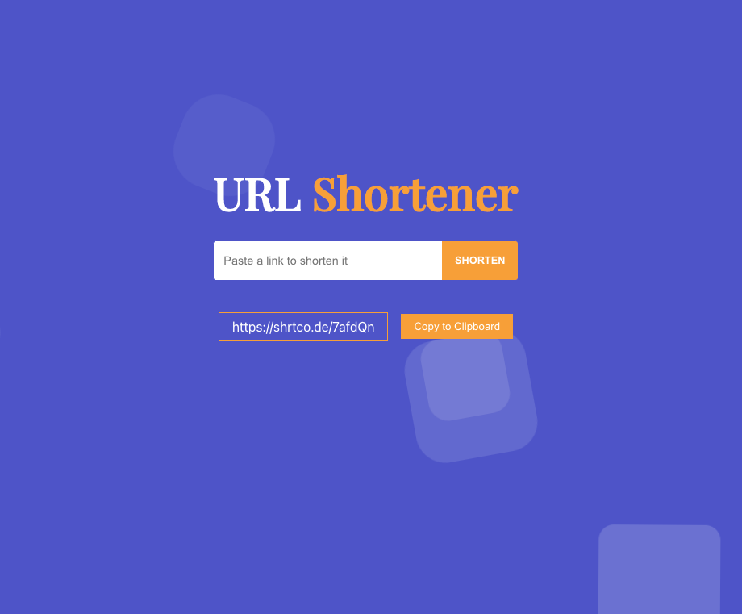

This project was bootstrapped with [Create React App](https://github.com/facebook/create-react-app).

## Available Scripts

In the project directory, you can run:

### `yarn install`

Instal All dependencies in this project

### `yarn start`
Open [http://localhost:3000](http://localhost:3000).

### Link

Shortener Api: https://shrtco.de/
background animation: https://wweb.dev/resources/animated-css-background-generator/
react-copy-to-clipboard: https://www.npmjs.com/package/react-copy-to-clipboard

